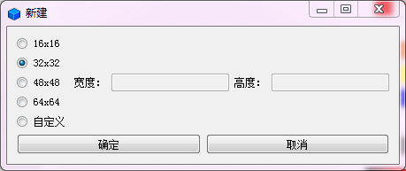
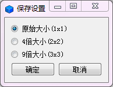
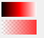

转自：[像素画](https://blog.csdn.net/ZJU_fish1996/article/details/52266463) 

**像素画工具**
* 像素画是以像素为基本单位进行绘制的画。同时，它也是一种设计风格，常用于图标（ICon）设计、logo设计、表情设计以及经典像素风游戏设计。像素画的绘制上手比较容易，对创作者最基本的要求是对色彩的把握，如明度对比、纯度对比。因为在像素画中，具体的线条概念可以是不明确的，而更多是由色彩来表达形体的。

* 开发这款工具的初衷，就是为了方便以后的设计。当然市面上也有类似的产品了，但是很多都不是免费的（当然本来也没有多少设计软件是免费的），我感觉它本身的实现并不难，所以就花了一点时间来自己动手写它。
   现在的功能还不那么完善，但是最基本的功能已经实现了，包括这款工具的所有图标都是用它自身绘制出来的。

**代码框架**

|   头文件       |                                            说明                                            |
| ------------- | ----------------------------------------------------------------------------------------- |
| button.h      | 继承自QToolButton, 在其基础上添加了一些函数。主要用于改变按钮样式。                             |
| colorbar.h    | 实现渐变的颜色条，继承自QWidget, 颜色改变后，可向画板、颜色面板发出信号通知它们修改颜色            |
| colorwindow.h | 实现颜色选择面板，继承自QWidget, 除了给定颜色，还可以在颜色对话框中选择新颜色。                   |
| newdialog.h   | 实现新建文件时的对话框，继承自QWidget。                                                       |
| paint.h       | 实现画板，完成所有绘制，继承自QWidget。                                                       |
| savedialog.h  | 实现保存文件时的对话框，继承自QWidget。                                                       |
| pixel.h       | 主界面，继承自QObject。包含了工具栏、菜单栏、图像栏的设计，以及所有控件的布局，以及它们之间的通信。 |

**功能介绍**
* 新建文件时，可以自定义窗口大小，考虑到性能问题，暂时只支持150X150以下的图像。

* 同样，可以加载一般的图片，但是大小也限制在150X150以下。
* 保存文件时，可以保存为原始大小，也提供了放大为原来的4倍，9倍的选项，放大图像采用了简单的重复进行上采样。在这里确实可以设计更多的选项，包括利用插值的上采样，以及更多的放大倍数，在这里由于时间关系没有* * 进一步扩展，但是图像还可以在设计软件如ps中进行进一步加工。

* 绘制方面，提供了单个像素点、矩形、圆形的绘制，另外，还提供了取色器、橡皮擦、油漆桶。
* 一开始的时候，只打算提供单一像素的绘制，但是后来考虑了一下，又加上了矩形和圆形，更多的体素暂时没有完成。 橡皮擦目前只支持擦除一个像素点，为了方便自己的使用，后续的维护过程中应该会陆续加上更多的功能。
* 此外，可以撤销，也可以重做（最多支持30步），可以选择显示网格与否。

* 颜色板中，除了自己摆的几个颜色外，还使用了qt内置的颜色对话框，可以选择丰富的颜色。
* 此外，我没有找到qt中提供的渐变颜色选择器，然后就自己实现了一个。

* 第一个是HSL空间中的明度变化图，第二个是透明度变化图。直接用鼠标点击就可以选择颜色。
* 有了这两个工具后，设计时选择合适的颜色就变得容易了很多。

**详细设计**
（一）画板
* 事件的重写
    主要的方法是重写了paintEvent（绘制事件）, mouseMoveEvent（鼠标移动事件）, mousePressEvent（鼠标点击事件）, mouseReleaseEvent（鼠标抬起事件）。
    利用状态量来标识当前的绘制状态（如：绘制像素点，绘制空心圆，绘制实心圆……），然后在各种事件中根据当前状态，利用switch case来采取对应的操作，由于工具栏与画板在不同的cpp中，每次改变工具，主窗体都需要发射一个信号通知画板改变状态量，每次修改图像后，都要调用update()来刷新当前画面。
         为了实时显示鼠标移动过程中的绘制状态，需要在一开始启动鼠标轨迹追踪（setMouseTracing（true））。
* 缓存
    在屏幕上显示的网格大小并不是真实的像素大小，而是要大一些。我们用map数组来存储每个网格的颜色信息，每次读取的时候遍历这个数组，把里面存储的颜色一个个显示到屏幕上。每次更新图像时，都要更新map数组。
    此外，因为鼠标移动时也会实时绘制，所以我们另外使用一个集合容器（currentPoint）来维护这些点，每次使用后就及时清空。
    除了当前画板的显示，我们在右侧还提供了实际图像的显示，这个图像由QImage暂存，因为QImage提供了像素点的底层操作。我们显示的时候，是将map数组的所有像素颜色直接调用setPixelColor复制过去的。又因为图像的显示是由主窗口控制的，所以我们提供了一个函数来返回包含这个QImage的QLabel的指针。由于新建的时候这个QImage将不再指向原来的内容，我们会发射一个信号通知主窗口更新图像指针。
 * 撤回与重做
    我们提供了撤回和重做的操作，在这里使用了最简单的方法来实现这一过程。在这里，我们支持30次回退，也就是说我们设计了30个map数组，每个map数组存储着某一时间状态下的完整图像，我们把所有图像当做一个队列来维护，所以我们事实上是通过front（队头）, rear（队尾）,layer(当前层)的修改来完成一系列操作的。这也就意味着，如果用户使用撤销后又继续绘制，新的绘制会覆盖用户原本可以重做的内容。这是因为我们保证了整个撤销重做是线性的，如果我们希望重做的内容不被覆盖，形成的将会是一个复杂的树形分支结构。
* 绘制
    点和矩形的绘制就是普通的绘制，在这里，直线和圆的绘制都使用了Bresenham算法，它们具体是什么原理，可以参考 这里。
      当然，这个算法虽然很经典，但是效果其实并不那么好，因为它最终形成的线是锯齿形的，而不是圆滑的。这并不是说这个算法是不正确的，这是用单一颜色绘制直线（圆）的最好效果了，但是为了达成圆滑的效果，我们往往采用灰度（明度）变化来表现线条的柔和，因为我不知道这个需要用什么算法，所以就没有进一步修改。

* 混色
    由于这里使用了透明度来绘制，就会出现不同透明度颜色混合的现象，所以就要考虑混色，关于混色，可以参考 这里。
* 填色
     颜色填充使用的算法是种子填充法，也就是不断地向四周递归搜索，如果颜色相同的话。我们知道点的邻域有四邻域和八邻域，计算机图形学相关的书籍指出：在填充算法中，我们一般选择四邻域。八邻域往往会导致“过分”填充，而四邻域往往会导致填充“不足”，但是，相比之下，不足是可以弥补的，而过分填充却是难以弥补的，所以我们更倾向于四邻域填充算法。

（二）颜色条

首先这里有两种颜色条，一个是明度颜色条，一个是渐变颜色条。渐变颜色条的实现很简单，就是不断地改变透明度（alpha通道）就可以了。
* 关于明度变化，QColor中一般使用RGB来存储颜色信息的，一开始我以为要自己去写两种色彩空间（从RGB到HSL）的转换，后来发现qt本身提供了这种转换，所以就直接调用了QColor的这个方法，这样一来，明度变化也很简单的。
* 至于这个渐变是怎样画出来的，实际上就是从0开始到255，不断变化明度（透明度），然后绘制一个个矩形。每个矩形的宽度就是width()/255，高度就是height()。在这里，我们的颜色与窗口坐标值是对应的，所以我们在点击这个颜色条的时候，也可以通过坐标值迅速的计算出选中的颜色。

